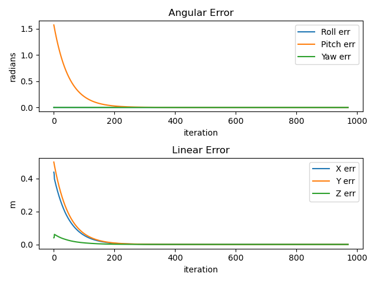

## Best
$K_p = 2 * \begin{bmatrix}1 & 0 & 0 \\
                           0 & 1 & 0 \\
                           0 & 0 & 1 \end{bmatrix}$

$K_i = 0.5 * \begin{bmatrix}1 & 0 & 0 \\
                           0 & 1 & 0 \\
                           0 & 0 & 1 \end{bmatrix}$

This is a feedforward + PI controller. I set the starting cube location to (0.5,0.5), and the ending to (0, -0.5). The orientations of the start and end positions stay the same. The error converges to 0 quickly. Additionally, the starting config vector is
$[0, -0.5, -0.5, 0, 0, 0, 0, 0, 0, 0, 0, 0, 0]$. Below, I plot the error over time.

