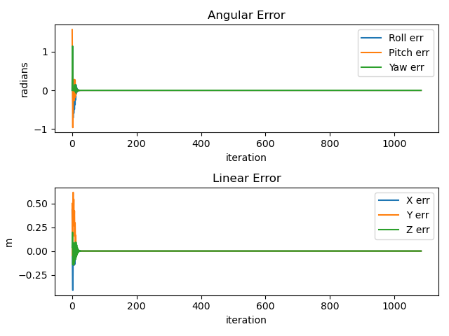

## Overshoot
$K_p = 170 * \begin{bmatrix}1 & 0 & 0 \\
                           0 & 1 & 0 \\
                           0 & 0 & 1 \end{bmatrix}$

$K_i = \begin{bmatrix}0 & 0 & 0 \\
                     0 & 0 & 0 \\
                     0 & 0 & 0 \end{bmatrix}$

This is a feedforward + P controller. The error converges to 0 by the end of first trajectory segment, but there is a large oscillation at the beginning of the motion. Additionally, the starting config vector is
$[0, -0.25, 0, 0, 0, 0, -1.57, 0, 0, 0, 0, 0, 0]$. Below, I plot the error over time.

